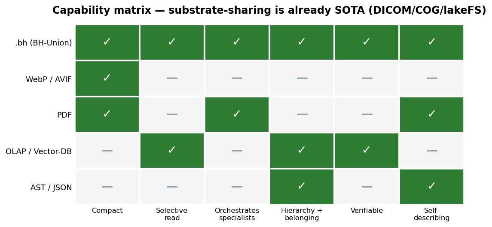
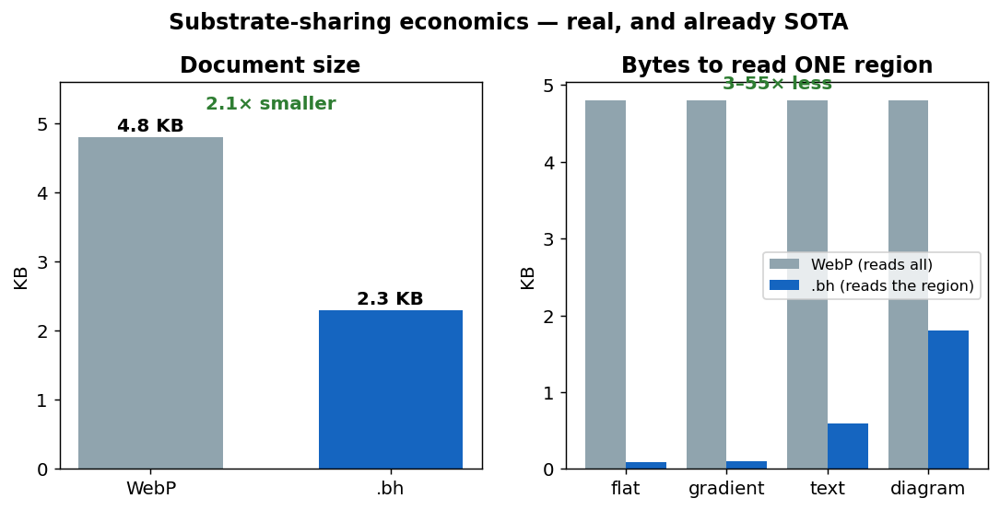
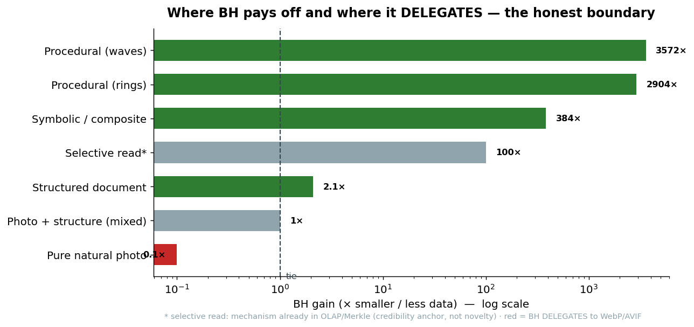
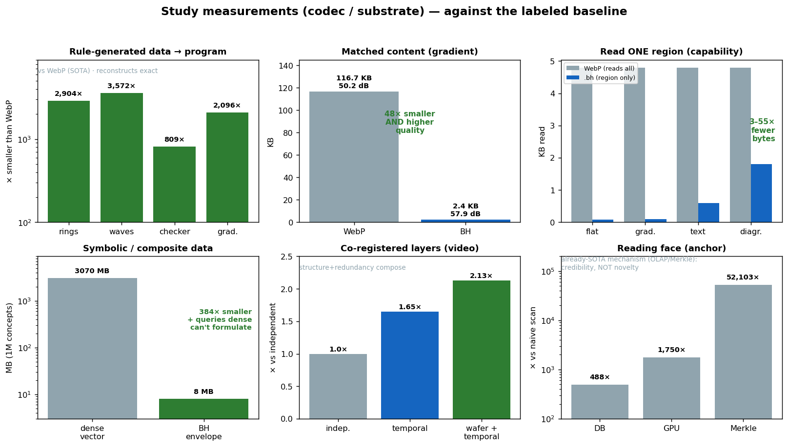

# Hierarchical Bits — Visual Pitch (comparative charts)

> A structure that represents a heterogeneous asset, navigates parts of it
> without loading everything, and delegates each region to the best specialist
> format.

---

## 0. The model, in one picture

The distinctive property (FCIR) in a single diagram: rival interpretations
co-registered over one immutable substrate, with adjudication deferred to a
read-time, optional choice.


> The charts below measure the *substrate-sharing* economics — real, but (the
> sweep found) already mature SOTA. The diagram above is the part that
> distinguishes BH; treat the charts as supporting evidence, not the headline.

## 1. Capability matrix — substrate-sharing (already SOTA)

Every format today covers only one piece. `.bh` is the only one that unites all
the capabilities in a single structure.



```
WebP/AVIF  → compact, but single reading, no orchestration nor hierarchy
PDF        → orchestrates and is self-describing, but a flat list, no selective read
OLAP/V-DB  → selective reading and hierarchy, but not a representation format
AST/JSON   → explicit structure, but not compact and doesn't orchestrate
.bh        → ALL capabilities, in one envelope
```

---

## 2. Substrate-sharing economics — real, and already SOTA

It's not "either compact or navigable". It's both, measured against WebP on a
structured document.



- **2.1× smaller** than WebP (each region in the format that suits it).
- **3–55× fewer bytes** to read any region — WebP decodes the entire file for
  any piece; `.bh` reads only the requested branch.

---

## 3. Where it pays off and where it delegates (the honest boundary)

BH is not universal magic. It pays off where the data is **structure** and
**delegates** where it's **dense signal**.



```
STRUCTURE (wins)          Procedural 2,904–3,572× · Symbolic 384× ·
                          Document 2.1×
SELECTIVE READ (anchor)   ~100×, but a mechanism that already exists (OLAP/Merkle):
                          credibility, not novelty
DENSE SIGNAL (delegates)  Natural photo: WebP/AVIF wins — BH calls it,
                          doesn't compete
```

The boundary is not the signal's entropy — it's **structure recognition**.

---

## 4. The measurements, one by one (where BH was superior, and against what)

Each real test, with the gain and **the baseline labeled** — visible honesty:
green where it wins vs state of the art, gray where it's an anchor (already-SOTA
mechanism).



```
Rule-generated data → program .... 800–3,572× smaller than WebP (reconstructs exact)
Matched content (gradient) ....... 48× smaller than WebP, with HIGHER quality
Reading one region (capability) .. 3–55× fewer bytes than WebP
Symbolic / composite data ........ 384× smaller + queries dense can't even formulate
Co-registered layers (video) ..... 2.13× (structure + redundancy compose)
Reading face (anchor) ............ 488–52,103× vs naive — but it's OLAP/Merkle,
                                   credibility, NOT novelty
```

---

## The three charts read together

1. **Chart 1** shows WHAT: a structure that does what today takes four.
2. **Chart 2** shows the PROOF: smaller AND navigable, in the same file, vs SOTA.
3. **Chart 3** shows the HONESTY: where it pays off (structure) and where it
   delegates (signal) — the credibility that makes an engineer trust it.

> The value isn't in the compressed block. It's in the structure that knows what
> that block means.

---

*Charts generated by `pitch_assets/generate_charts.py` and `generate_evidence.py`
from the study's real measurements (see `BH_MASTER.md`). PNGs in
`pitch_assets/en/`.*
