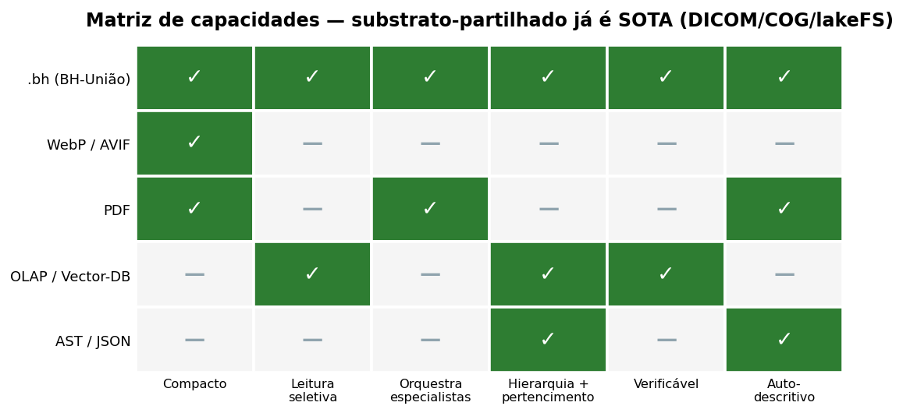
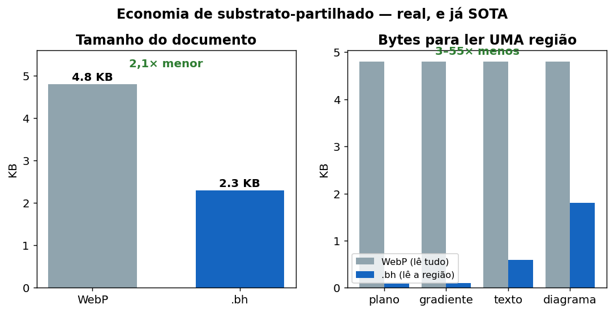
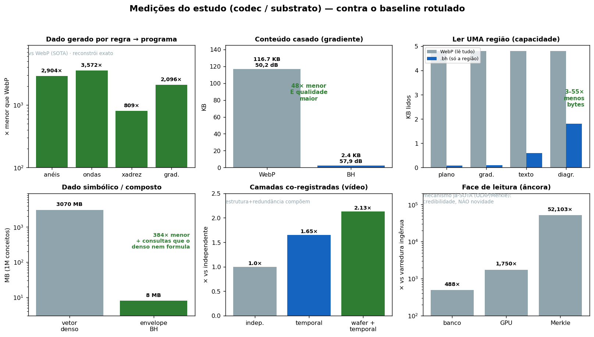

# Bits Hierárquicos — Pitch Visual (gráficos comparativos)

> Uma estrutura que representa um ativo heterogêneo, navega por partes dele sem
> carregar tudo, e delega cada região ao melhor formato especialista.

---

## 0. O modelo, numa imagem

A propriedade distintiva (FCIR) num único diagrama: interpretações rivais
co-registadas sobre um substrato imutável, com a adjudicação diferida para uma
escolha opcional no momento da leitura.


> Os gráficos abaixo medem a economia de *substrato-partilhado* — real, mas (a
> varredura mostrou) já SOTA maduro. O diagrama acima é a parte que distingue o
> BH; trata os gráficos como evidência de apoio, não como o destaque.

## 1. Matriz de capacidades — substrato-partilhado (já SOTA)

Cada formato de hoje cobre só um pedaço. O `.bh` é o único que une todas as
capacidades numa estrutura só.



```
WebP/AVIF  → compacto, mas leitura única, sem orquestração nem hierarquia
PDF        → orquestra e é auto-descritivo, mas lista plana, sem leitura seletiva
OLAP/V-DB  → leitura seletiva e hierarquia, mas não é formato de representação
AST/JSON   → estrutura explícita, mas não compacto nem orquestra
.bh        → TODAS as capacidades, num envelope
```

---

## 2. Economia de substrato-partilhado — real, e já SOTA

A economia de substrato-partilhado é real — medida contra o WebP num documento
estruturado — **mas a varredura mostrou que este padrão já é SOTA maduro**
(DICOM, COG, lakeFS, CRAM…). *Não* é onde o BH difere; é evidência de apoio, não
o destaque.



- **2,1× menor** que o WebP (cada região no formato que lhe convém).
- **3–55× menos bytes** para ler qualquer região — o WebP decodifica o arquivo
  inteiro para qualquer pedaço; o `.bh` lê só o ramo pedido. *(Leitura seletiva
  — a parte já-SOTA, não o diferencial.)*

---

## 3. Onde rende e onde delega (a fronteira honesta)

O BH não é mágica universal. Ele rende onde o dado é **estrutura** e **delega**
onde é **sinal denso**.


```
ESTRUTURA (ganha)           Procedural 2.904–3.572× · Simbólico 384× ·
                            Documento 2,1×
LEITURA SELETIVA (âncora)   ~100×, mas é mecanismo já existente (OLAP/Merkle):
                            credibilidade, não novidade
SINAL DENSO (delega)        Foto natural: o WebP/AVIF ganha — o BH o convoca,
                            não compete
```

A fronteira não é a entropia do sinal — é o **reconhecimento da estrutura**.

---

## 4. As medições, uma a uma (onde o BH foi superior, e contra quê)

Cada teste real, com o ganho e **o baseline rotulado** — a honestidade visível:
verde onde ganha vs estado da arte, cinza onde é âncora (mecanismo já-SOTA).



```
Dado gerado por regra → programa ... 800–3.572× menor que WebP (reconstrói exato)
Conteúdo casado (gradiente) ........ 48× menor que WebP, com qualidade MAIOR
Ler uma região (capacidade) ........ 3–55× menos bytes que o WebP
Dado simbólico / composto .......... 384× menor + consultas que o denso nem formula
Camadas co-registradas (vídeo) ..... 2,13× (estrutura + redundância compõem)
Face de leitura (âncora) ........... 488–52.103× vs ingênuo — mas é OLAP/Merkle,
                                     credibilidade, NÃO novidade
```

---

## A leitura dos três gráficos, junta

1. **Gráfico 1** mostra o QUÊ: uma estrutura que faz o que hoje exige quatro.
2. **Gráfico 2** mostra a PROVA: menor E navegável, no mesmo arquivo, vs SOTA.
3. **Gráfico 3** mostra a HONESTIDADE: onde rende (estrutura) e onde delega
   (sinal) — a credibilidade que faz um engenheiro confiar.

> O valor não está no bloco comprimido. Está na estrutura que sabe o que
> aquele bloco significa.

---

*Gráficos gerados por `pitch_assets/generate_charts.py` a partir das medições
reais do estudo (ver `BH_MASTER.md`). PNGs em `pitch_assets/`.*
